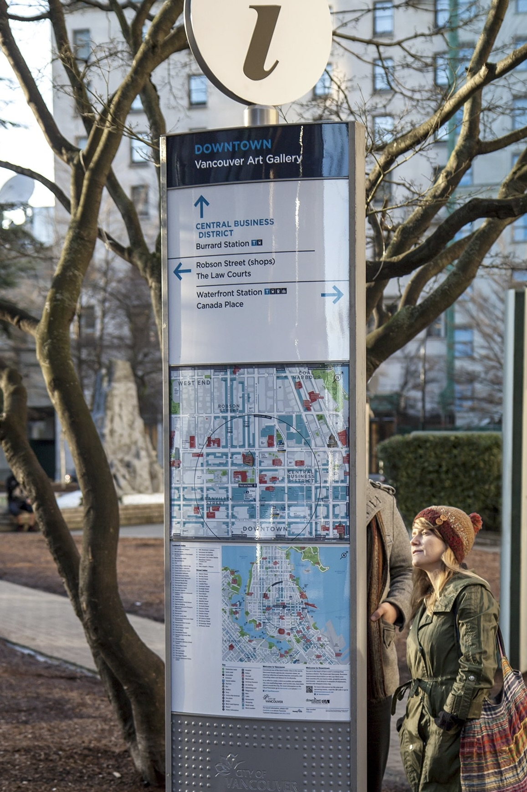
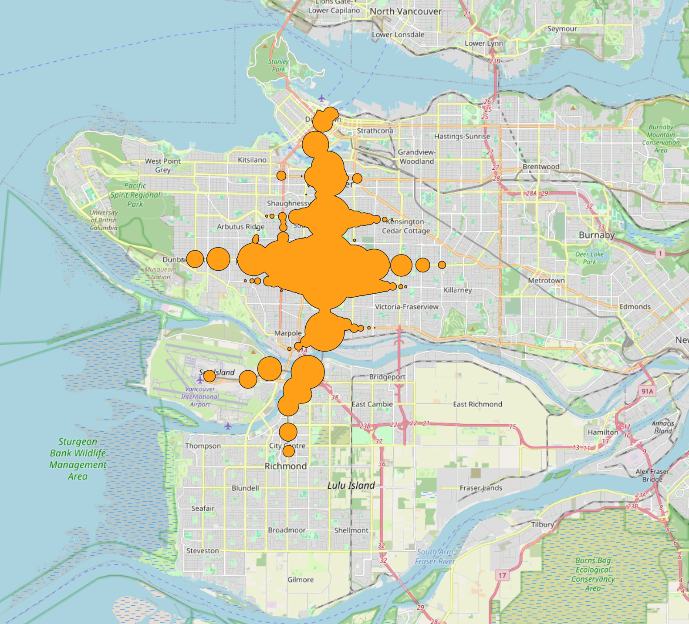
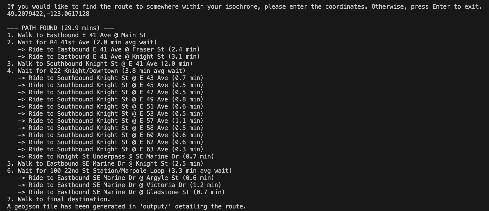

### About this project
This is a project I am using to learn python and explore my interest in integrating programming and mathematics into transportation engineering!

Have you ever come across one of these boards downtown, showing how far you can walk within five minutes?

What if you could customize these to show how far you can get in any amount of time, using not only your legs, but also transit! And what if you could play with factors like bus frequency, infrastructure failure, and walk speed? That's exactly what this project is!

This project will be an interactive dashboard that lets users visualize the resiliency of the Metro Vancouver transit network. By selecting a specific location and time of day, the dashboard will generate a 'travel bubble' on the map, showing exactly how far a person can get within a set time limit using transit (busses, Skytrain, etc.).

Users will then be able to modify city conditions by interacting with on-screen options. For example, they can simulate a snowstorm by slowing down buses, or simulate a major infrastructure failure by virtually closing the Lions Gate Bridge, and watch as the travel bubble shrinks. Finally, the tool will include accessibility features, allowing users to adjust walking speeds to see how these disruptions disproportionately affect seniors or those with limited mobility compared to the average commuter.

### Current Project Status
This project is currently in progress. I have a working  backend, meaning most of  the functionality is there. You can generate 'travel bubbles' using this program. You are able to visualize them by importing the generated .geojson file into a GIS application such as ArcGIS or QGIS. 

After creating these bubbles, you can input a second coordinate into the program and it will return the path to get there using transit, as well as a line you can import to GIS that visualizes the path.

#### Next Steps
Next, I will work on learning Shiny for Python to create a front end so that the user does not need to use a GIS application. Finally, I will work on some advanced features, including toggling bus/skytrain, changing service frequency, changing walking speeds, disabling infrastructure and more!

#### Problems Solved
**Water:** The program initially assumed you could walk straight over water, since the travel bubbles spread from each reachable bus stop with a circle of radius: (walking speed * leftover time budget). To fix this, I combined data from government OpenData sites to create a .geojson file, a polygon of all land within Metro Vancouver. Performing an intersection with this file and the resulting file from my program deletes all of the travel bubble that is over water. However, there was still travel buubble over top of unreachable islands. To fix this without incorporating another graph layer of the street network, I used a spatial join to remove all polygons not containing a disembark point.

**Routing:** The program initially drew straight lines between bus stops. This is usually fine, but for some express routes, the straight line between stops is obviously wrong. To fix this, I took advantage of the distance_traveled column of the stop data. For every individual transit trip, the program uses a splicing function to grab the points in "shapes.txt" with distance_traveled values between the board and disembark stops. This results in extremely accurate routing.

### Downloading GTFS Data
This project requires updated Translink GTFS Data. 

1. Download latest static GTFS data here: https://www.translink.ca/about-us/doing-business-with-translink/app-developer-resources/gtfs/gtfs-data
2. Unzip file and bring data into ./txt_data folder
3. Run app_simple.py

### Running Files
Currently there is no GUI! In this development stage, you can run simple_app.py and follow the terminal commands. To change some parameters like walking speed and maximum allowable walk distance, you can edit them in a code editor.

### Sources
This project uses open data files from various governments:
- [Province of BC Boundary Terrestrial](https://open.canada.ca/data/dataset/30aeb5c1-4285-46c8-b60b-15b1a6f4258b)
- [Metro Vancouver Administrative Boundaries](https://open-data-portal-metrovancouver.hub.arcgis.com/datasets/1c86f57d9fcc4fc3a8134328b07f07e6_10/explore?location=49.283369%2C-123.061408%2C9.87)
- [Province of BC Freshwater Atlas Rivers](https://catalogue.data.gov.bc.ca/dataset/f7dac054-efbf-402f-ab62-6fc4b32a619e)
